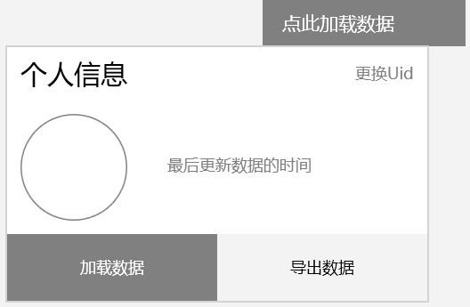
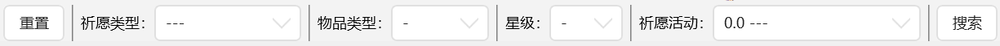
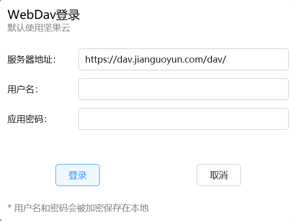
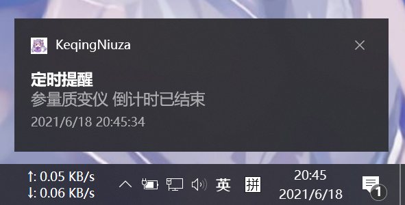
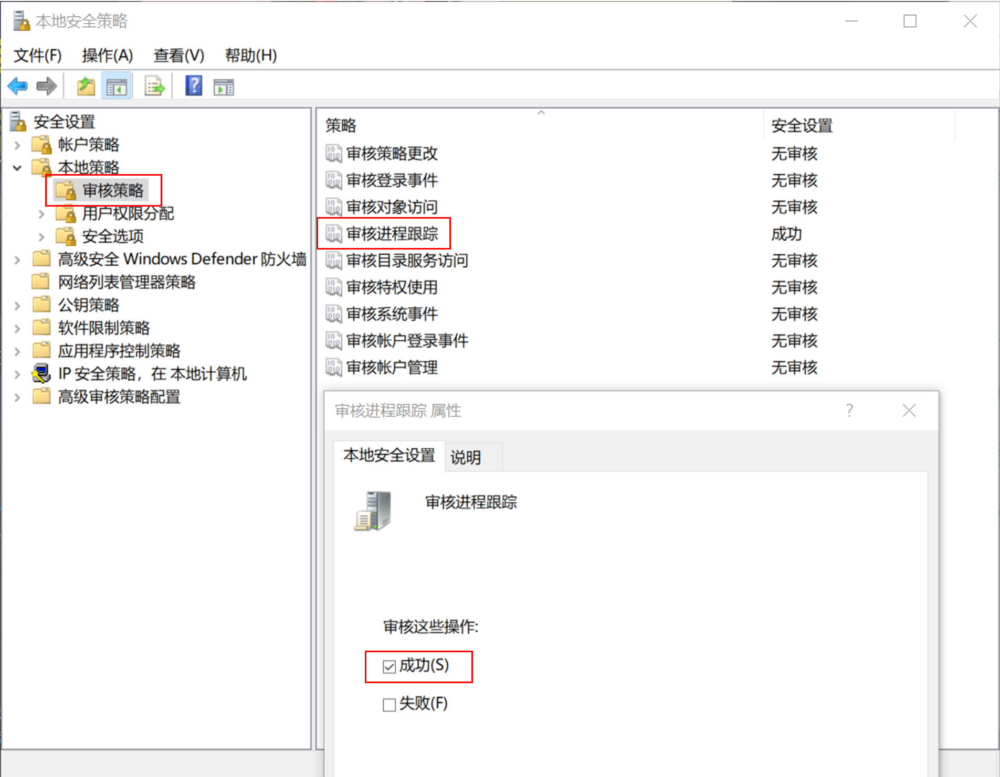
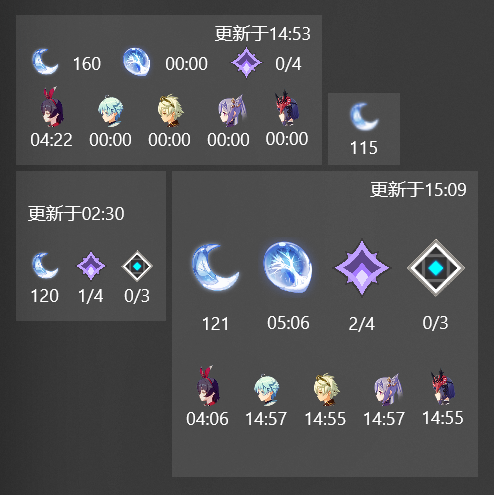
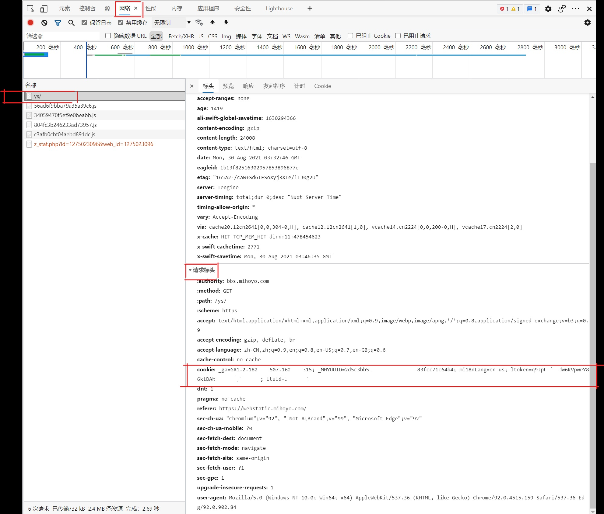

# 刻记牛杂店使用手册

更新时间：2021-11-02 15:32:48

适用版本：2.2.0

[版本更新记录](https://github.com/Scighost/KeqingNiuza/blob/main/ChangeLog.md)

~~能用就行，要啥自行车~~

## 运行环境

Windows 10 1903 及以上版本，推荐 Windows 10 20H1 及以上版本。

## 目录

**使用手册中相对于上个版本有更新的内容会在目录中标出。**

此目录为简单目录，完整目录参考阅读器自带的目录功能。

- [开始使用](#开始使用)
- [功能介绍](#功能介绍)
- [使用教程](#使用教程)
  - [祈愿分析](#祈愿分析)
  - [云备份](#云备份)
  - [任务提醒](#任务提醒)
  - [流浪大地的乐团](#流浪大地的乐团)
  - [实时便笺](#实时便笺)  **`有更新`**
  - [其他功能](#其他功能)
- [拓展功能](#拓展功能)
  - [米游社签到](#米游社签到)
- [常见问题](#常见问题)
  - [如何在Windows 7上使用](#如何在windows-7上使用)
  - [对路径......的访问被拒绝](#对路径的访问被拒绝)
  - [出现没有祈愿数据的错误](#出现没有祈愿数据的错误)
  - [大小保底的统计出现错误](#大小保底的统计出现错误)
  - [个人信息是否安全](#个人信息是否安全)
  - [支持外服吗](#支持外服吗)
  - [签到时出现尚未登陆](#签到时出现尚未登陆)
  - [启动器和主程序窗口有点大](#启动器和主程序窗口有点大)
  - [米游社签到去哪儿了](#米游社签到去哪儿了)
- [运行过程中的权限使用](#运行过程中的权限使用)
- [建议与反馈](#建议与反馈)

## 开始使用

运行 **KeqingNiuza Launcher.exe**，等待下载主程序。

如果在**检查更新**过程中遇到错误，检查是否能访问[该网址](https://xw6dp97kei-1306705684.file.myqcloud.com/keqingniuza/meta/version.json)；

如果在**下载文件**过程遇到错误，检查是否能访问[该网址](https://cdn.jsdelivr.net/gh/Scighost/KeqingNiuza@cdn2/meta/version.json)；

**主程序运行过程中使用 MS App Center 收集非个人信息用于改善体验（主要是修Bug）。**

注意：运行过程中需要**读写权限**，**不要**把文件夹放在 `Program Files` 内。

## 功能介绍

- 祈愿记录加载及分析
- 每日/每周任务提醒
- 自动演奏风物之诗琴
- 推荐壁纸
- 米游社签到

## 使用教程

### 祈愿分析

#### 加载祈愿记录

- 在游戏中打开任意祈愿历史页面，**游戏内需使用简中**

- 点击**加载数据**

  

#### 短时间内获取多个账号的祈愿记录

- 依此点击上图右上角的 **更换Uid** -> **添加Uid**
- 重复**加载祈愿记录**中的步骤

#### 已有祈愿记录网址

在**关于页面**手动输入祈愿记录网址。

#### 忽略第一个5星

丢失6个月前的祈愿记录会导致统计结果不准确，可以根据卡池选择忽略第一个5星，勾选后会将该卡池的第一个5星及之前的记录（3星和4星）不纳入统计范围。

#### 角色和武器展示

图中右上角的数字是统计范围内**获得的数量**，不是指命座。

#### 数据展示

**数据页面**的顶部工具栏可对所有数据进行筛选，右侧搜索框对**物品名称**进行搜索。

#### 祈愿预测

预测的结果根据[一棵平衡树](https://space.bilibili.com/6165300)的[抽卡模型（200k+条数据）](https://www.bilibili.com/read/cv10468091)计算而得，仅代表一般规律。

#### 导出/导入记录

- 导出：个人信息中点击**导出数据**
- 导入： **关于页面**找到导入6个月之前的数据的操作按钮，**`2.1.5更新`** 导入模板有 `Excel文件` 和 `Json文件` 两种
  - Excel文件
    - 模板参考导出时的文件（注意表名），但导入时仅需要下表中的**前四项**，且顺序需一致
    - 
    - 选择文件后会按照时间倒序展示所有的数据，方便跳过已有的行数
    - 如果选择的文件中丢失了祈愿id，则导入时会按照时间顺序从 `1000000000000000001`开始递增
    - 从 `2.1.5版本` 开始，若数据丢失了祈愿id，**则不再按照时间和名称检测是否重复**，请自行找到与本软件已有的数据并跳过指定的行数，然后再导入
  - Json文件
    - 官方模板，根元素为数组 `[{...},{...},{...}]` ，详见 `UserData` 文件夹中的 `WishLog_....json` 文件

### 云备份

你的所有个人数据保存在 `UserData` 文件夹内，可以备份至支持WebDav的网盘。

- 点击窗口右上角那朵云
- 默认使用坚果云WebDav服务，支持更改为其他WebDav服务
- 填写账号和**应用密码**
  - 注意：是**应用密码**，不是账号密码
  - [坚果云第三方应用授权WebDAV开启方法](https://help.jianguoyun.com/?p=2064)

备份功能会将 `UserData` 文件夹压缩并备份至网盘 `KeqingNiuza/Archive/` 路径下，文件命名与时间相关，每自然小时内新备份的文件会**覆盖**旧文件。

~~还原备份会**删除**本地 `UserData` 文件夹，并下载最新的备份文件。~~

还原备份**不会删除** `UserData` 文件夹，但是本地文件会被备份文件中的重名文件覆盖。

### 任务提醒

此功能使用Windows 10的系统通知，效果如下：（老图了，那时还叫定时提醒）

任务分为两种类型——倒计时型（如参量质变仪）、恢复型（如原粹树脂），添加新任务的流程是：

- 在任务提醒页面点击**添加新任务**
- 输入任务名称，选择任务类型
- 编辑任务信息
  - 倒计时型触发间隔格式为：日.时:分:秒，剩余时间、下一次触发时间选一个填写
  - 恢复型类似，当前值可以通过拖动滚动条修改
- 一定要**保存修改**

保存后会在到达指定时间时发送系统通知（通知没关闭的话），点击**测试通知**按钮提前测试。关机或其他情况有可能会错过通知，另有两种提醒方式，可在**设置页面**启用：

- 开机后一分钟提醒
- 开始游戏前提醒（运行原神启动器后）

上述两种提醒方式通过系统任务计划运行，修改此设置需要**管理员权限**。

开始游戏前提醒需要启用**审核进程跟踪**（此功能需要Windows专业版）：

- 运行 `secpol.msc`
- 依次点击 本地策略>审核策略>审核进程跟踪
- 勾选成功，并保存

### 流浪大地的乐团

没什么好介绍的：

- 此功能需要管理员权限
- 后台演奏：原神窗口被遮挡的情况下仍能自动演奏
- 添加其他Midi文件：把文件复制到 `.\bin\resource\midi\` 文件夹下
- 此功能不太稳定，有可能会导致程序闪退（对游戏没有影响）
- ~~外服玩家需要在**设置页面**开启外服选项~~ `2.1.2更新:` 不再需要开启外服

### 实时便笺

此功能适用于 `Windows 10 20H1` 及以上版本（Windows 11 不可用），以磁贴的方式呈现。

#### 安装签名证书

为什么要安装签名证书，请参考 [固定桌面应用中的辅助磁贴](https://docs.microsoft.com/zh-cn/windows/apps/design/shell/tiles-and-notifications/secondary-tiles-desktop-pinning) 和 [向未打包的桌面应用授予标识](https://docs.microsoft.com/zh-cn/windows/apps/desktop/modernize/grant-identity-to-nonpackaged-apps)，本人承诺证书仅用于此项目，并且不外泄证书密码。

- 在文件夹中找到 `Digital_Certificate_for_KeqingNiuza_by_Scighost.cer` ，双击打开，点击安装证书
- 存储位置选择 **本地计算机**
- 点击 **将所有的证书都放入下列存储**
- 点击 **浏览**，选择 **受信任的根证书颁发机构**
- 后略

#### 注册程序包

- 在设置页面找到 **实时便笺** 的入口

- 打开后如果显示 **未注册程序包** ，点击注册程序包按钮

**注意：不要重复注册，会导致已固定的磁贴处于无法更新的状态，取消固定可解决**。

#### 设置Cookie

参考 [米游社签到](#米游社签到) 。

#### 添加定时刷新任务

通过系统定时运行程序刷新便笺状态，也可以点击磁贴手动刷新。

#### 固定磁贴时显示添加成功，但没有在开始菜单找到

重启计算机后重新固定。

#### 实时便笺的窗口没有图标

这个问题没有办法解决。

#### 卸载程序包

暂时没有较好的办法，推荐使用 [Dism++](https://www.chuyu.me/zh-Hans/index.html) 。

在Appx管理页面找到 `KeqingNiuza...` 包（一般在最后），手动删除即可。

### 其他功能

#### 更换头像

点击窗口右上角个人信息，卡片出来后点击派蒙头像。

#### 推荐壁纸

设置页面启用下载推荐壁纸，下次运行启动器时会下载推荐壁纸，文件会保存在wallpaper文件夹内，该文件夹内的图片会在启动器运行时随机展示，图片内容仅代表我的喜好。

#### 跳过启动器更新检查

写这个软件的最初原因是biuuu的 `Genshin Wish Exporter` 启动速度太慢了，没想到加了启动器后耗时也到了3s；虽然启动器右上角有一个跳过键，但是不太好点到。

`2.1.3更新:` 新增了启动器的一些快捷操作：

- 跳过更新检查：`鼠标左键双击` ，`键盘Space键` ，`键盘Enter键`
- 关闭启动器窗口：`鼠标右键双击` ，`键盘Esc键`

**注意：**开始下载更新文件后，不能跳过，只能关闭。

## 拓展功能

第一次启动主程序后会保存拓展设置文件 `.\UserData\ExtensionSetting.json`，内容如下：

|属性|解释|值 (默认值加粗)|
|---|---|---|
|EnableHoyolabCheckin|启用米游社签到|true / **false**|

### 米游社签到

#### 获取Cookie 

- 使用浏览器登陆米游社
- 按下**F12**，打开调试工具
- 刷新页面
- 在调试窗口依次选择 `网络`、`ys/`、`标头`、`请求标头`、`cookie`
- 把cookie的值完整复制下来
- **注意：需要包含 `cookie_token` 值，如果没有重新登陆一次**（我这张图里就没有）

#### 保存Cookie

- 在**米游社签到页面**点击**更新Cookie**
- 把上述步骤中复制的值粘贴到新出现的方框中
- 如果需要签到多个米游社账号，使用 `#` 分隔获取的`Cookie`
- 点击保存

#### 设置自动签到

- 转到**设置页面**，打开自动签到并保持
- 其他设置
  - 始终显示结果：默认情况下会在签到失败时通知，启用此项签到成功时也通知
  - 签到时间：自动签到开始的时间
  - 随机延迟：签到会在延时时间内随机选择一个时间点运行

自动签到也是通过系统任务计划运行，如果因为关机或其他原因错过了签到时间，系统会保证开机后立刻运行，一整天不开机那就没办法了。签到成功和失败的日志分别保存在 `Log\DailyCheck.txt` 和 `Log\DailyCheck-Error.txt` 文件内。

如果想要更方便或更多功能，参考 [原神签到小助手 每日福利不用愁](https://www.yindan.me/tutorial/genshin-impact-helper.html) 。

## 常见问题

### 如何在Windows 7上使用

下载并安装 [.NET Framework 4.8 Runtime](https://dotnet.microsoft.com/download/dotnet-framework/net48) 即可。

**注意：**在Windows 7系统上，任务提醒功能无法使用，米游社签到功能不会有通知提醒。

### 对路径......的访问被拒绝

一般是因为没有该文件夹的**写入权限**，一劳永逸的解决方法是对相关文件夹授予写入权限，麻烦点就每次启动使用管理员模式。

### 出现没有祈愿数据的错误

大概率是卡池信息没有更新造成的，运行 `KeqingNiuza Launcher.exe` 更新一下。（以后会逐步解决这个问题
`2.1.5更新` 应该不会再因为卡池信息的不完整出现这个问题，而是真的找不到这个Uid的数据。

### 大小保底的统计出现错误

是卡池信息没有更新造成的，运行 `KeqingNiuza Launcher.exe` 更新一下。

### 个人信息是否安全

所有个人信息都保存在 `UserData` 文件夹内，云备份账号密码、米游社Cookie加密保存，其他信息明文存储，加密密钥根据系统 `MachineGuid`和系统用户名随机生成，每台设备的密钥不相同。

### 支持外服吗

~~支持，但需要在**设置页面**开启外服选项，该选项影响祈愿分析和演奏功能。~~

`2.1.4更新:` 支持，不再需要勾选外服设置项。

### 签到时出现尚未登陆

Cookie 过期了，需要在浏览器里重新登陆一遍。

### 启动器和主程序窗口有点大

你屏幕小了，在我这儿挺合适的。

### 米游社签到去哪儿了

已隐藏入口，不会影响已设置过的自动签到，启用方式参考[拓展功能](#拓展功能)。

## 运行过程中的权限使用

软件运行过程中除了加载必要的运行组件和对本文件夹读写以外，还会进行以下操作：

- 联网
  - 获取祈愿记录
  - 软件更新
  - 壁纸下载

- 读取
  - 获取祈愿记录网址
    - 国服：`%UserProfile%\AppData\LocalLow\miHoYo\原神\output_log.txt`
    - 外服：`%UserProfile%\AppData\LocalLow\miHoYo\Genshin Impact\output_log.txt`
  - 计算 DeviceId 和 加密密钥
    - 注册表项：`HKEY_LOCAL_MACHINE\SOFTWARE\Microsoft\Cryptography\MachineGuid`
    - 系统当前用户的用户名
- 读写
  - 软件设置（框架自动读写）：`%UserProfile%\AppData\Local\KeqingNiuza`
  - 任务计划：任务提醒和米游社签到的自动运行（可运行 `taskschd.msc` 查看）
- 管理员权限
  - 更改任务计划：需要管理员权限才能在开机后和游戏启动前进行任务提醒
  - 自动演奏风物之诗琴
    - 原神游戏使用管理员权限启动，需要同等权限才能对齐进行操作
    - 演奏过程中使用 [PostMessage](https://docs.microsoft.com/en-us/windows/win32/api/winuser/nf-winuser-postmessagew) 给游戏窗口发送键盘消息

## 建议与反馈

反馈方式：在Github上 [提issues](https://github.com/Scighost/KeqingNiuza/issues) 或发邮件至 scighost@outlook.com

反馈请带上 `Log` 文件夹下的日志，并且描述使用情况；与祈愿记录相关请带上 `UserData` 文件夹下文件。

